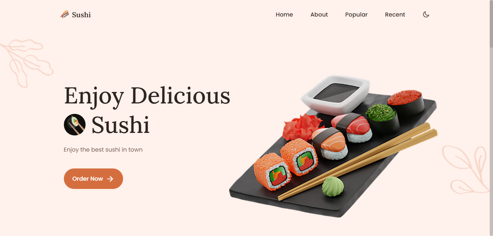
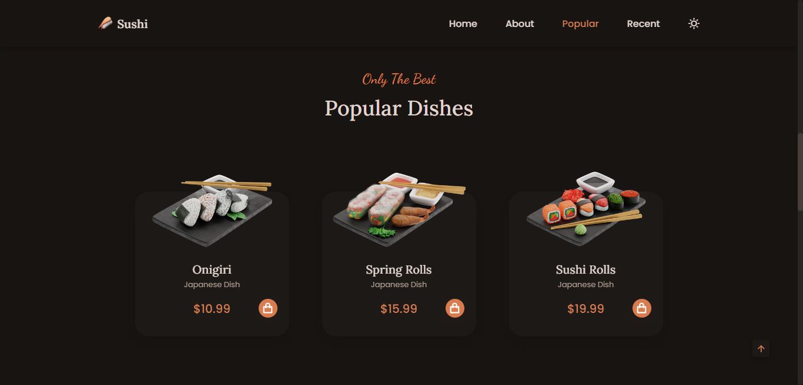
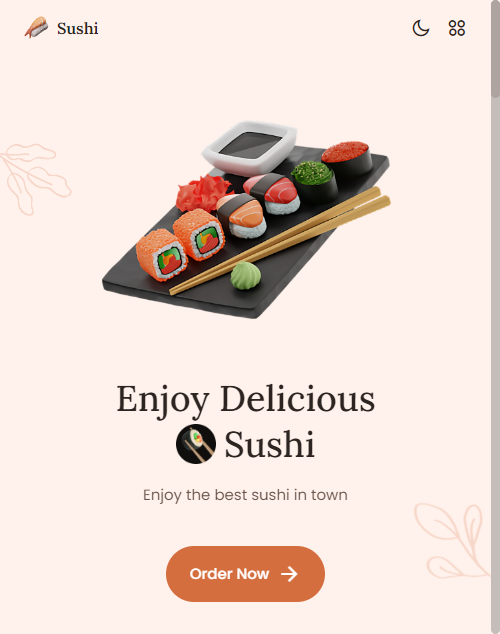

# SUSHI RESTAURANT WEBSITE

MADE WITH VANILLA JS, CSS AND HTML

  

## SCREENSHOTS

 

### HOMEPAGE

 

 

### DARK MODE

 

 

### MOBILE RESPONSIVE

 

  

### ALL CREDITS TO **_BEDIMCODE_**. CHECK OUT [THIS PROJECT TUTORIAL](https://www.youtube.com/watch?v=HW1zt2EPMqY) ON YOUTUBE